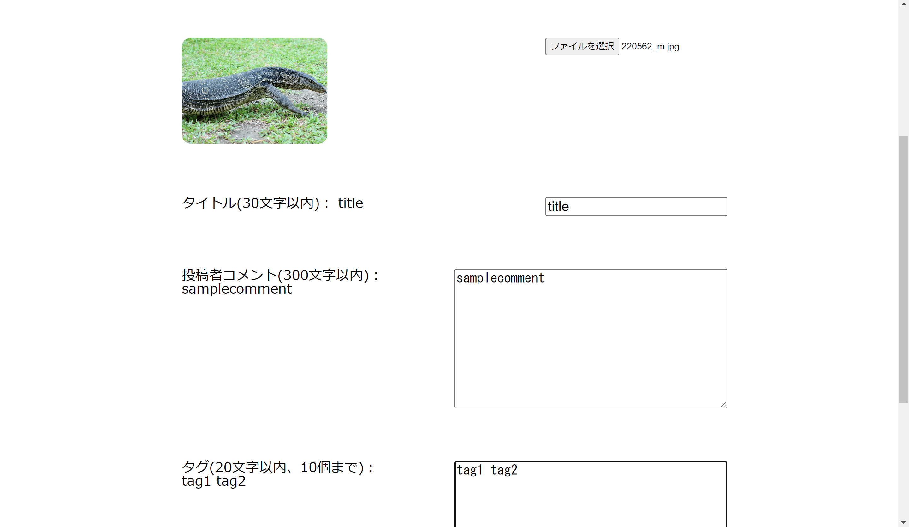
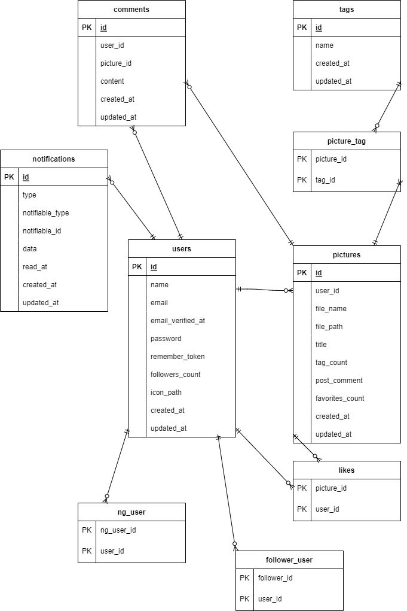

# アプリケーション名：Picoo

概要説明

Picooは画像投稿、タグ付け、タグによる投稿画像の検索、画像投稿者のフォローなどの機能を備えたアプリです。投稿された画像に「いいね」したり、コメントを投稿したりできます。また、フォローユーザーが画像を投稿した際に通知を受け取ることができます。

以下は投稿ページと画像一覧ページのスクリーンショットです。

< --- アプリ画面の画像 ---- >

## 作成した目的

概要説明

このアプリは画像の投稿とタグによる分類・整理のために作成しました。

## 機能一覧

- 画像を投稿しタグと紐づける（タグはスペースで複数設定可、１つの画像に10個まで）
- 自分の画像に投稿者コメントとタイトルを付けられる
- 紐づけたタグによって画像検索をする（タグはスペースによって複数検索できる）
- 自分の画像を削除する
- ユーザーの投稿した画像一覧を表示する（ユーザーページ）
- 自分の投稿した画像を削除する
- 画像にコメントを投稿できる（投稿者コメントとは違い投稿者以外もコメント可能）
- 画像にいいねをする・いいねを解除することができる
- ユーザーに対してフォローする・フォローを解除することができる
- いいねした画像を表示する
- フォローしたユーザーを表示する
- ユーザーをNG登録・NG解除する(NGしたユーザーのコメントは非表示になる)
- フォローしたユーザーが画像を投稿した際に通知を受け取る
- 通知一覧を表示する
- 通知を既読化して非表示にする
- いいねされた数が多い画像とフォロワー数の多いユーザーの上位20を表示する

## 使用技術（実行環境）

- php 8.1.6
- Laravel Framework 8.83.27
- php(amazon linux 2) 8.2.3
- laravel Framework 8.83.27
- Docker 20.10.23

## テーブル設計
< --- 作成したテーブル設計の画像 ---- >

## ER図
< --- 作成したER図の画像 ---- >

# 環境構築

環境構築(XAMPP)　(.envの設定はXAMPP用のものにしてください)

特に断りのない限りプロジェクト直下でコマンドを入力する

mysql -u root -p　でmysqlを起動

mysqlで create database picoodb; と入力してデータベースを作成する

その後ctrl+cでmysqlを抜ける

mysqlから出た後はCLIでコマンドを入力していく

composer require "laravel/breeze=1.9.0" --dev　

php artisan breeze:install　でbreezeの導入

npm install && npm run dev　でnpmの導入

ここからモデルとマイグレーションファイルを作成する

php artisan make:model Picture -m

php artisan make:model Tag -m

php artisan make:model Comment -m

php artisan make:migration create_picture_tag_table

php artisan make:migration create_likes_table 

php artisan make:migration create_follower_user_table

php artisan make:migration create_ng_user_table

php artisan notifications:table

ここまでのコマンドですべてのマイグレーションファイルが作成されたので　php artisan migrate　でテーブル作成する

php artisan make:notification PictureNotification　で通知用ファイルの作成

php artisan make:controller PictureController

php artisan make:controller UserController　で2つのコントローラファイルを作成する

php artisan storage:link でシンボリックリンクを作成する

php artisan make:request PictureRequest

php artisan make:request CommentRequest　で２つのリクエストファイルを作成する

php artisan make:seeder UsersTableSeeder

php artisan make:seeder PicturesTableSeeder

php artisan make:seeder TagsTableSeeder

php artisan make:seeder CommentsTableSeeder

php artisan make:seeder PictureTagTableSeeder

ここまでのコマンドでシーダーファイルが作られたので　php artisan db:seed　でシーディングする

php artisan make:factory UserFactory　でテスト用のファクトリファイルを作成する

create database picootestdb; (mysqlを起動した状態で)

mysqlを抜けてから　php artisan migrate --database=mysql_test　でテスト用データベースにテーブルを作成する

php artisan make:test PictureControllerTest

php artisan make:test UserControllerTest　で２つのテスト用ファイルを作成する

vendor\bin\phpunit tests\Feature\PictureControllerTest.php

vendor\bin\phpunit tests\Feature\UserControllerTest.php　でテストの実行

## Dockerでの環境構築

(ここからはdockerの立ち上げ用のコマンドになりますがDocker Desktop および ubuntuの導入が必要です)

(sailがない場合はインストール)composer require laravel/sail --dev

php artisan sail:install　（docker-composeの生成）（その後0,3,4　を選択）

（ubuntuで dockerのコンテナをすべて稼働させる　初回はコンテナ作成も）

./vendor/bin/sail up -d 

docker exec -it picoo-mysql-1 bash でmysqlコンテナに入り、

その後 mysql -u sail -p で　パスワード：passwordを入力してmysqlにログイン

その後、 create database picoodb; でデータベース作成し、mysqlから出る

docker-compose exec laravel.test php artisan migrate でテーブル作成

docker-compose exec laravel.test php artisan storage:link　でシンボリックリンク作成

## 他に記載することがあれば記述する
メール認証システムにmailtrapを利用しているのでmailtrapの登録が必要です。

envファイルは別途お渡しします。（2点あり、XAMPP,Dockerに対応）